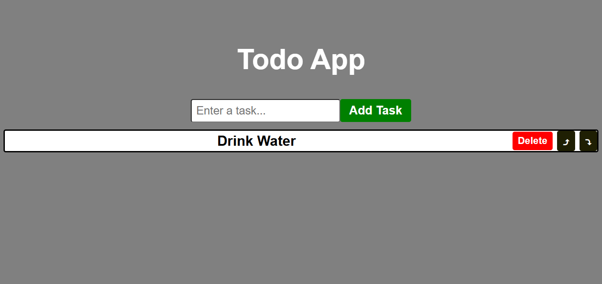

# 📝 React Todo List App

A simple and clean Todo List application built using **React**. This app allows users to add tasks, delete them, and reorder them using up and down buttons.

## 🚀 Features

- ✅ Add new tasks
- ❌ Delete existing tasks
- ⬆ Move tasks up
- ⬇ Move tasks down
- 🔄 Real-time task updates with React state

## 🛠 Tech Stack

- React (Functional Components & Hooks)
- JavaScript (ES6)
- HTML/CSS

## 📂 Folder Structure

```

todo-list-app/
├── public/
│   └── index.html
├── src/
│   ├── Todo.js       # Main Todo Component
│   ├── App.js        # Root App Component
│   └── index.js      # Entry point
├── package.json
└── README.md

````

## 📸 Preview



```md

````


## ✨ Future Improvements

* Persist tasks using localStorage or backend
* Add edit functionality
* Task completion toggle
* Responsive design and better UI

## 📄 License

This project is open-source and available under the [MIT License](LICENSE).

---

Made with ❤️ by Satyam Rana(https://github.com/FeralSatyam)
